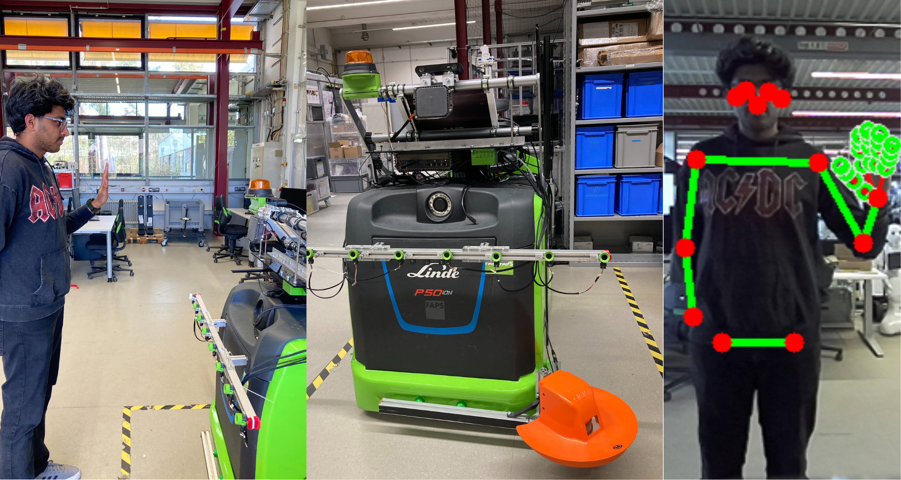
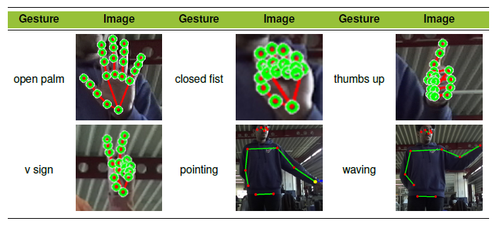
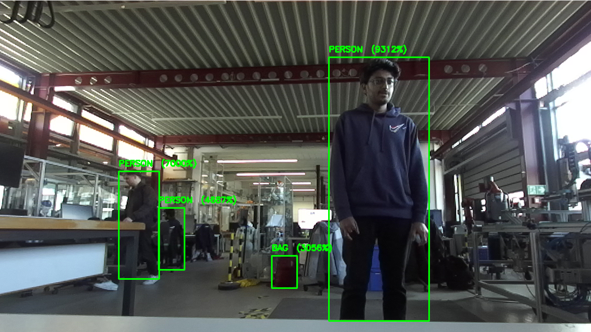

# Vision based Human-Robot Interaction for AMR using ZED 2i

This repository provides a complete real-time gesture recognition system using the **ZED 2i stereo camera** and **ROS 2 Humble**. It supports both static and dynamic gestures using MediaPipe and TensorFlow, and controls a robot based on recognized gestures.

---

## System Overview



> *Architecture showing how the gestures are shown in front of an AMR*

---

## Supported Gestures Table



> *Table of all static and dynamic gestures with their corresponding labels.*

---

## System Requirements

- Ubuntu 22.04 LTS
- ROS 2 Humble
- CUDA (compatible with your GPU)
- ZED SDK 4.2 or later
- Python 3.10+
- TensorFlow with GPU support
- ZED ROS2 Wrapper

---

## Step-by-Step Setup

### 1. Setup Environment


- Get ROS2 Desktop Full and Visual Studio Code: [Shell script UNA ROS2 and VS Code](https://git.faps.uni-erlangen.de/robotik-public/una-unified-arbeits-umgebung/shell-script-una-ros2-and-vs-code-basic-install)

```bash
echo "source /opt/ros/humble/setup.bash" >> ~/.bashrc
source ~/.bashrc
```

---

### 2. Install ZED SDK and ROS2 Wrapper(Source: https://www.stereolabs.com/docs)

- Install the ZED Python API: [ZED Python](https://www.stereolabs.com/docs/app-development/python/install)

Getting Started #

The Python API is a wrapper around the ZED SDK which is written in C++ optimized code. We make the ZED SDK accessible from external Python code using Cython.

    To start using the ZED SDK in Python, you will need to install the following dependencies on your system:

    Python 3.6+ (x64)
    Cython 0.26+
    Numpy 1.13+
    OpenCV Python (optional)
    PyOpenGL (optional)

- ZED SDK (see Installation section): [ZED SDK](https://www.stereolabs.com/en-de/developers/release)

    Make sure to install Python (x64 version) and the pip package manager. Then install the dependencies via pip in a terminal.


```bash
Linux:

python -m pip install cython numpy opencv-python pyopengl
```
```bash
Windows:

py -m pip install cython numpy opencv-python pyopengl

```

## Installing the Python API 
A Python script is available in the ZED SDK installation folder and can automatically detect your platform, CUDA and Python version and download the corresponding pre-compiled Python API package.

- Install ZED ROS2 Wrapper: [ZED 2i ROS Documentation](https://www.stereolabs.com/docs/ros2)

    To install the zed_ros2_wrapper, open a bash terminal, clone the package from GitHub, and build it:
```bash
# Create your ROS 2 Workspace if you do not have one
mkdir -p ~/ros2_ws/src/
# Move to the `src` folder of the ROS 2 Workspace
cd ~/ros2_ws/src/ 
git clone https://github.com/stereolabs/zed-ros2-wrapper.git
cd ..
sudo apt update
# Install the required dependencies
rosdep install --from-paths src --ignore-src -r -y
# Build the wrapper
colcon build --symlink-install --cmake-args=-DCMAKE_BUILD_TYPE=Release
# Setup the environment variables
echo source $(pwd)/install/local_setup.bash >> ~/.bashrc
source ~/.bashrc
```

---

### 3. Clone Gesture Recognition Package

```bash
cd ~/ros2_ws/src
git clone https://github.com/cvishakh/gesture_classification_zed2i.git
cd ~/ros2_ws
colcon build --symlink-install
source install/setup.bash
```

---

## Python Dependencies

```bash
sudo apt install python3-pip
pip3 install numpy opencv-python mediapipe tensorflow==2.14.0
```

> ⚠️ For TensorFlow GPU: Make sure you have CUDA 11.8 and cuDNN 8.x/9.x properly installed and compatible with your TensorFlow version.

---

## 4. Launch Full System

```bash
ros2 launch gesture_recognition gesture_system.launch.py
```

This launches:
- ZED2i camera node
- Gesture recognition node
- Robot controller node

---

## Gesture Class

**Static Gestures:**
- ✋ open_palm
- ✊ closed_fist
- 👍 thumbs_up
- ✌️ v_sign

**Dynamic Gestures:**
- 👋 waving
- 👉 pointing (Depth value Z)

---

## ROS Topics

**Subscribed:**
- `/zed/zed_node/left/image_rect_color`
- `/zed/zed_node/depth/depth_registered`

**Published:**
- `recognized_gesture` → `std_msgs/String`
- `pointing_coordinates` → `geometry_msgs/Point`

---

## Object Detection with ZED 2i (Separate Module)

In addition to gesture recognition, this project includes a standalone **object detection module** using the **ZED Python API**.

📄 **Script location**: [`object_detection_zed.py`](./object_detection_zed.py)

### 🔍 What it Does

- Initializes the ZED 2i camera with `HD720` resolution and `PERFORMANCE` depth mode.
- Enables **multi-class object detection** with support for:
  - Real-time tracking of objects across frames (`enable_tracking`)
  - Instance segmentation (`enable_segmentation`)
- Draws bounding boxes and class labels (with confidence score) on the live camera feed.
- Displays live feed in an OpenCV window.
- Objects are accessed through the `sl.Objects()` container with updated metadata.

### 📸 To Run

Ensure your environment has access to the ZED SDK and required Python dependencies:

```bash
python3 object_detection_zed.py
```

## Object Detection Demo



> *Sample object detection using ZED 2i showing bounding boxes and class labels.*


## Repo Overview

```text
gesture_classification_zed2i/
├── dataset/                            # Collected gesture datasets
├── gesture_recognition/                # Python package with ROS2 nodes
├── model/                              # Trained models
├── notebook/                           # Jupyter notebooks for training
├── samples/                            # Images for demo
│   ├── Cover_Image.png
│   ├── Object_detection.png
│   └── Gesture_Definition.png
├── check_cuda.py                             # CUDA availability check
├── dynamic_dataset_collection.py             # Dynamic gesture data collection script
├── static_dataset_collection.py              # Static gesture data collection script
├── object_detection_zed.py                   # ZED 2i object detection module
├── gesture_recognition.code-workspace        # VS Code workspace
├── Gesture_Recognition_for_Enhanced_HRI.pdf  # Research/project documentation
├── LICENSE
├── README.md

---

## Notes

- All gesture logic runs in real-time.
- Pointing coordinates are depth-depended.
- Works with ZED 2i and TensorFlow (GPU-accelerated).
- Launch-ready and easily extendable.

---

## Test

```bash
ros2 topic echo /recognized_gesture
ros2 topic echo /pointing_coordinates
```

---

## Author

**Vishakh Cheruparambath**  
- Mail: vishakh.cheruparambath@fau.de 
- Powered by ROS2 + ZED2i + TensorFlow + Google Mediapipe
- Supervised by: Jakob Hartmann, MSc, FAPS LAB Erlangen
---

More documentations and info: 
- KOLAMEeRo Project Overview: [FAPS Website](https://www.faps.fau.de/curforsch/adaptive-und-benutzerfreundliche-kollaboration-von-menschen-und-autonomen-mobilen-robotern-durch-kontinuierlich-lernende-algorithmen/)
- Google Mediapipe Hand and Pose estimation landmarks: [Google MediaPipe](https://github.com/google-ai-edge/mediapipe/tree/master)
- Stereolabs ZED 2i Camera: [Get start with ZED](https://www.stereolabs.com/docs/get-started-with-zed)
- ROS 2 Humble Tutorial: [Get start with ROS2](https://docs.ros.org/en/humble/Tutorials.html)


> For contributions or issues, submit a merge request on [GitHub](https://github.com/cvishakh/gesture_classification_zed2i/)
## Keywords
Gesture recognition, ZED Camera, Human-robot interaction, Autonomous Mobile Robot, Intralogistics